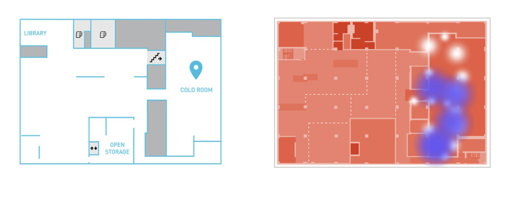
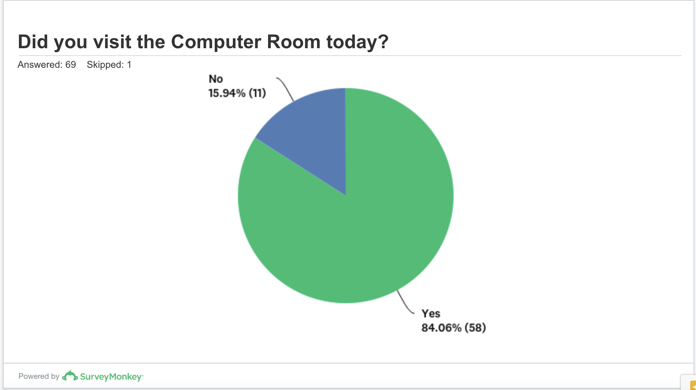
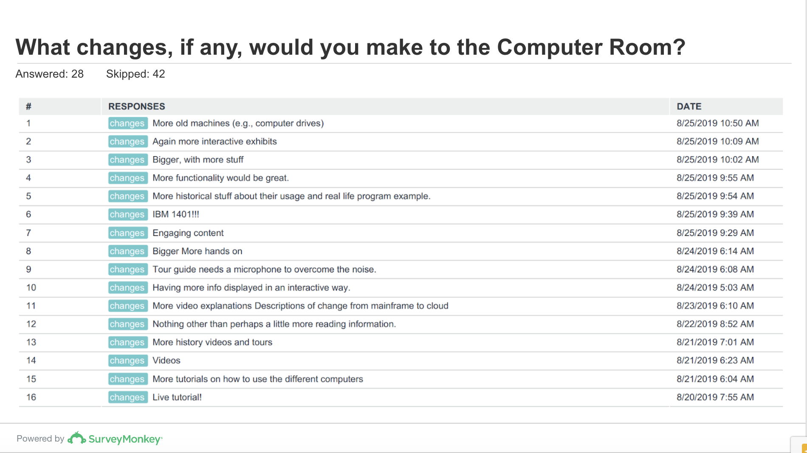
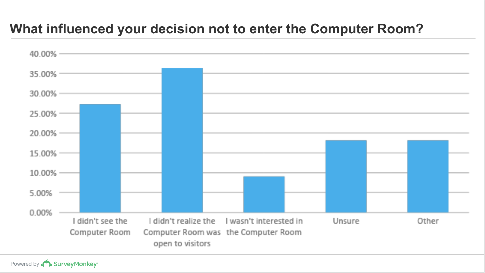

## tldr;

In this project, I designed a mixed-methods study to evaluate visitor experiences in an existing museum exhibit. Through a combination of data analysis methods, I pinpointed a number of challenges within the exhibit. I translated these findings and my suggested solutions into a renovation proposal. I achieved buy-in from key stakeholders to move forward with my proposed design recommendations.

## Introduction

This project was my final deliverable for my internship at Living Computers: Museum + Labs (LCM+L) in 2019. LCM+L is a computing history museum located in Seattle. LCM+L features a collection of restored vintage computers that are available for public use. 

#### The Computer Room exhibit at LCM+L. Image credit: Wikipedia.

This project is focused on an exhibit called the Computer Room. This exhibit was designed to mimic an air conditioned room where mainframe computers would have been stored in the 1960s and 1970s. The Computer Room at LCM+L showcases restored mainframes that are available for public use, including a DEC PDP-10 and an IBM System 360.

Compared to other exhibits that featured minicomputers and vintage game consoles, the Computer Room exhibit had relatively low attendance. This had been demonstrated in previous visitor research at the museum, and confirmed anecdotally by staff. With a renovation on the horizon, the museum wanted to understand how visitor experiences in this exhibit could be improved.

## Design challenges

The goal of this project was to make design recommendations to improve visitor experiences in the Computer Room. In particular, the museum was interested in improving experiences for people with no prior experience with mainframes and vintage computing--i.e. a non-technical audience. 

Before deciding how to tackle this task, I identified a few challenges that I saw as particularly relevant to visitor experiences in the Computer Room:

+ The exhibit is behind large doors that are necessary for temperature regulation--it is **physically separate and somewhat hidden from the rest of the museum.**   

+ The exhibit **is not very welcoming**--at its essence, the exhibit is a windowless room full of giant machines. Unless someone sees the signage, they might think they have accidentally entered a storage room.   

+ The exhibit was very popular with vintage computing enthusiasts, just not with other visitors. It was important **avoid making changes that would compromise the experience of visitors with technical expertise.**  

## Part 1: Synthesizing prior evaluation data

At the beginning of this project, I took time to synthesize prior visitor research that had been conducted at the museum. In particular, Bree Lohan's 2017 study had conducted a quantitative analysis of where visitors spend time at the museum. 

#### **Left:** Map of the second floor of the museum. **Right** A heatmap of the space. Blue shading denotes low visitation. Image credit: Lohan, 2017

As part of her evaluation, Lohman conducted a time-motion study, which is visualized by the heatmap above. Results show that visitors spend an average of 7.64 minutes in the Computer Room. The modal visit duration for all visitors was around 2 minutes, suggesting that the average was increased by a few outlier individuals who spent closer to 10 to 12 minutes in the Computer Room. 

Visitors under 18 and visitors who identified as women spent an average of 4.0 minutes and 6.0 minutes in the Computer Room, respectively. Average visiting time increased to 9.0 for visitors who identified as male. Visitors who interacted with the terminals spent an average of 11.9 minutes in the exhibit, regardless of gender. **This data suggests that the space resonated more with certain groups of visitors, particularly those with enough technical knowledge to interact with the terminals.**

## Part 2: Qualitative analysis of visitor personas

I collected three types of data to better understand visitor experiences:

- 5 interviews with tour guides and museum facilitators
- 6 tour observations, which included a total of 43 guests
- 70 survey responses, collected from visitors at the museum leaving the 2nd floor

To guide the my data analysis, I drew on John Falk's (2007) schema of visitor identities. His work suggests that visitor motivations for attending a museum can be understood through the lens of 5 identities:

- **Explorer**: needs to satisfy personal curiosity
- **Facilitator**: wishes to spend time with loved ones
- **Experience-seeker**: aspires to experience the best things within a culture 
- **Professional/Hobbyist**: desires to deepen knowledge of specific subject matter
- **Recharger**: hopes to recharge emotionally, physically, and spiritually

These identities are not absolute or finite, as one visitor could have a combination of these motivations at any time, or have distinct motivations on different visits to the same museum. I used this framework in tandem with visitor research data in order to make design recommendations. 

I identified three identities that are particularly relevant to LCM+L:

The **Professional or Hobbyist identity** is consistent with data related to visitors who have historically been the museum's core demographic—people with a passion for vintage computers. A 2017 member survey suggested that many original members of the museum participate in technology as a career or hobby, and that they became members because they believed in LCM+L's restoration work and mission.

The **Facilitator identity** relates to data that suggests the LCM+L has become more popular with families in recent years. A push to welcome visitors with children into the space saw a rise of family memberships, which now make up the majority of the museum's members.

The **Explorer** relates to data suggesting that LCM+L visitors strongly self-identify as curious, life-long learners. These visitors may have a technical background similar to the Professional, but because they skew younger than the Professional they typically lack the firsthand experience with many of the vintage systems at LCM+L. In other words, LCM+L is a way to learn about history, rather than reconnect with their past.

## Results

Here I will summarize a few important findings from the survey study, interviews, and visitor observation.

The survey indicated that 84.06% of respondents visited the Computer Room during their visit. This data is consistent with Lohman’s numbers from 2017. I believe there may be some inflation due to confusion regarding what the Computer Room is and is not. A common clarifying question during the survey was ‘Wait—what’s the computer room? Is it the whole second floor?’ 

As with any sample size this small, these results should not be held as statistically rigorous. Additionally, I didn’t ask about how long visits to the Computer Room lasted or what visitors did while visiting. If we assume the results from the 2017 time motion analysis to hold true, the average length of these visits were less than 8 minutes long. 

This visual depicts written-in answers to the open-ended question, ‘what changes would you make, if any, to the Computer Room?’ This question was only posed to respondents who indicated that they had entered the Computer Room during their visit. Of the 58 surveyed, 16 visitors offered suggestions.

Notice the repeated mention of a desire to see video, interactivity, and tutorials in the space. Additionally, one person noted the need for tour guides to be mic’d in order to overcome ambient noise. This was something came up in interviews with tour guides, particularly when speaking to a larger group.

Finally, we posed a series of questions to visitors who indicated that they did not visit the Computer Room. We directly asked them why they did not visit the Computer Room. Not seeing the space and not realizing it was accessible to visitors were two of the most cited factors for not entering the Computer Room.

## Design Recommendations

After analyzing my data, I presented 3 main design recommendations to key stakeholders at the museum.

### Recommendation 1: Increase the Visibility of the Exhibit

35% respondents who didn’t visit the Computer Room reported being unsure if the space was open to visitors. 27% respondents who didn’t visit the Computer Room reported not seeing the space. These findings were supported by tour guides who reported visitors being confused about where they could go.

Small changes, like adding increased signage outside of the Computer Room could make a difference in the visibility of the exhibit. Directive lighting or floor decals are another option that could help guide people to walk towards the exhibit. The benefit of these changes is that they do not require a significant financial investment, yet they could yield measurable results.

### Recommendation 2: Increase Awareness of Restoration Work

Based on interviews with tour guides, many visitors are unaware of the museum's efforts to restore vintage computers. A large amount of time and energy goes into sourcing machines, repairing physical components, and configuring software for visitors to use. LCM+L has an entire team of engineers dedicated to restoring machines and maintaining the collection.

To help visitors understand the ‘What’ and the ‘Why’ of the Computer Room, I suggest adding colorful inforaphics about what a mainframe is and how it fits in computing history. This information can help orient visitors without a technical background.

Additionally, adding more content that showcases the Engineering department (i.e. photos, bios, current projects, etc.), as well as LCM+L’s mission statement can help put the rest of the room in context. By pulling back the curtain on the context of this exhibit, we can demonstrate why this work is important. 

Making changes to highlight restoration work would serve two important purposes. First, as previously mentioned, it would help orient visitors without a technical background. Second, information about the Engineering department and their restoration work would appeal to the museum's core demographic as well.

### Recommendation 3: Create Opportunities for Structured Exploration

As previous evaluations at the museum revealed, very few guests venture into the back corners of the Computer Room. I recommended that the museum explore the possibility of creating a clearly defined, numbered path with stops at each system. This would allow visitors to engage with the space independently, with enough structure to prevent becoming overwhelmed.

This structured path could include tutorials on how to use the machines, or other interactive activities. These changes would also address the survey suggestions of including more interactive activites. 

### Take-aways

After my presentation, stakeholders at the museum including the curator approved my design recommendations to be incorporated into an upcoming renovation. Unfortunately, this project ended just before the pandemic and the museum closed its doors indefinitely due to public health concerns. The renovation remains on hold.

Still, the findings from this research remain relevant:

- Visibility is key to attracting attention. This is a well-documented issue in exhibit design literature.

- Context matters when trying to engage new audiences. Craft signage to answer questions like "what is this?" and "why is this important to me?".

- Consider how to add points of entry for engagement. Guiding the visitor through the space, not simply drawing them in, is vital to creating meaningful experiences.

