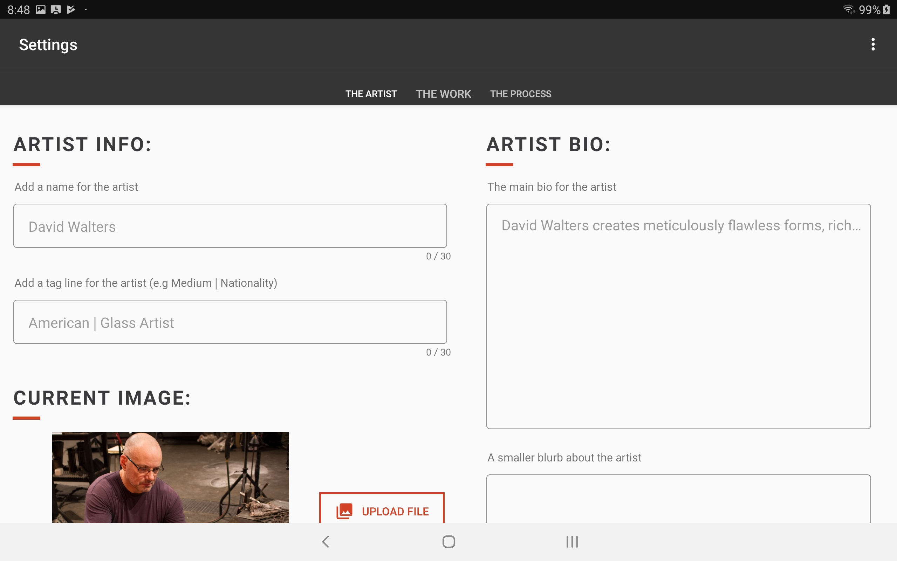

## tldr;

In this project, I led a team of other 3 students in developing an Android application featuring museum artifacts. My contributions included implementing the front-end of the application based on data from my 2018 ethnographic study. Additionally, I collaborated with curators and exhibit designers to design a physical kiosk to house the application.

This project was a collaboration between the Museum of Glass in Tacoma, WA and students at the University of Puget Sound. The team consisted of my peers Nick Bigger, Marwan Johnson, Kayla Ramos and myself. This project was active from November 2018 to June 2019. This work was the basis for my Capstone project at the end of my Computer Science degree. 

## Introduction

#### Outside the museum. Credit: Museum of Glass

This project was motivated by my previous research on the role of educational technology in art museums. I was curious how digital tools might be able to provide additional context for the art pieces in the museum's collection. I approached curators at the Museum of Glass to see if they would be open to collaborating and they were excited to work with me to design something new for the museum. Katie Buckingham, curator, and Rebecca Engelhardt, collections/exhibitions manager, were our main contacts for this project.

## Design Brief

Curators expressed a desire to showcase video content that was only available on the museum's website. Something unique about the Museum of Glass is their Hot Shop--a studio space where artists create blown glass while visitors watch the process live. The museum possessed a number of videos of artists making pieces of art that were displayed around the museum.

I suggested that we try to create an interactive object label that would sit next to a piece of art. Unlike a traditional written description of the piece, visitors could watch videos of the artist describing their process and actually creating the piece in front of them.

#### Examples of traditional object labels with written descriptions of pieces. 

I pitched the project to the Computer Science seniors at my college. I selected 3 students who has applied to join my team, and we started working on the kiosk.

## Development

We decided create an Android application that would displayed on a locked tablet. This decision was partially movitated by budget--we knew that Android tablets would be less expensive for the museum to purchase. Additionally, the tablet was a good size for this context. We wanted the label to be big enough to be easy to read, but not so big that it detracts from the art itself.

After deciding that we were building an application in the Android environment, we had to refine exactly what kind of information the label would convey. Below is an initial sketch I created, as well as a wireframe Nick created.

#### **Left**: Initial sketch of the object label; **Right**: A wireframe of what the homepage of the label might look like.

Our contacts at the museum requested that we create an application that they can log into and edit on their own--rather than pulling directly from the online catalogue. This allows for flexibility, and avoided some concerns they had about the format of their database. 

During this initial phase, Marwan explored how to create an admin portal that the front-end could pull information from. Kayla focused on security considerations, including how to prevent visitors from closing the app and using other tablet features. 

We also visited the museum to get a sense of the space, and to meet with exhibition designers. We shared the measurements of the tablet we were testing on, and brainstormed ideas for how to enclose the tablet in a secure way.

## Final Product

We opted to use a tabbed layout in the final design. Below is a sample of what visitors would see in the application:

Below is a sample of what an admin would see in the application:

We delivered a presentation introducing the museum team to the app. We created documentation detailing how to use the admin portal, and how to reset credentials in the event of a forgotten password. The interactive label was planned for installation in late 2019.

